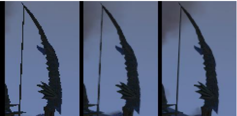
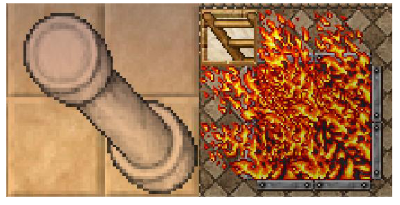
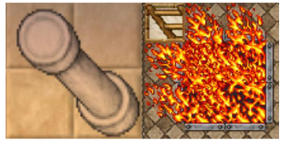

# COMPUTACAO VISUAL - Semana 5 - Teoria 

NOME: Lucca Dias Bartholomei 
TIA: 31910017

NOME: Heitor Ce Sun Lin
TIA: 31930451

NOME: Gustavo de Araujo Ramos 
TIA: 32088531

## Filtro de suavização (Blur) para resolução de problemas - Aliasing nos jogos eletrônicos

Uma área que se tem como ferramenta essencial da computação gráfica é a de jogos, onde se exige uma boa parte dos hardwares para 
criação e visualização de imagens. Algumas limitações existem quanto à essa ferramenta de processamento gráfico na área de jogos em 
representar quantidade de cores e pixels de uma imagem processada, uma dessas limitações são os efeitos serrilhados que podem ocorrer 
nas cenas/imagens, devido a presença de aliasing(que são comuns na maioria dos jogos), o aliasing age como redução na qualidade de uma 
imagem (má renderização, otimização) amostrada se comparada com a imagem que deveria trazer originalmente, o presente artigo da pesquisa 
traz uma ánalise do problema de serrilhagem, motivos de suaocorrência e apresentação de soluções que possam solucionar este problema.

Como solução para o problema iremos utilizar o Anti-Aliasing (AA) que é subdividido em dois tipos de filtragem. 
O primeiro tipo de filtro consiste em aumentar a taxa de amostragem. Os filtros que utilizam este algoritmo são: SSAA, MSAA.

SSAA é uma maneira alternativa de executar as correções dos defeitos causados pelo aliasing de bordas serrilhadas
com um filtro que traz a suavização das imagens presentes, renderizadas em programas e games das mais variadas plataformas encontradas.
O MSAA funciona de forma diferente. Ele reduz o poder de processamento necessário em comparação ao SSAA, 
pois ele detecta as bordas dos polígonos nos objetos 3D e antes da renderização aumenta a amostragem na divisão entre eles. 

O segundo tipo de filtro consiste em borrar (Blur) os serrilhados que também é chamado de AA pós processamento. 
As técnicas que utilizam este algoritmo são: FXAA e SMAA.

O FXAA consiste em um dos modos de pós-renderização que trabalha com “filtro de borrão”. 
Primeiro ele detecta o contraste das bordas serrilhadas no frame capturado e depois "borra" nas proximidades da borda, 
o que resulta numa redução notável dos serrilhados. Por ele não fazer nenhuma diferenciação entre a borda e textura, 
assim como a borda ele borra a textura. O SMAA pode ser considerado a união do FXAA e MSAA, ou seja, ele é a junção
entre pré e pós processamento. Para o pré-processamento baseado em borrão é utilizado a técnica FXAA, e para 
a detecção de serrilhados é usado a técnica MSAA. É considerado a melhor técnica de AA pois reduz muito bem os serrilhados
e ao mesmo tempo não borra demasiadamente a imagem e o custo benefício é o melhor dentre as técnicas apresentadas anteriormente. 

Figura 1: A esquerda o frame sem Anti-Aliasing, ao meio o frame com FXAA, a direita o frame com SMAA.

Como solução para o problema, tendo em vista o custo benefício, uma das mais indicadas é a utilização doo SMAA, pois esta combinação entre pré e pós
processamento juntamente ao preço que não tão alto faz este algoritmo de anti-aliasing ser considerado o melhor dentre os comentados até agora.

### Aliasing

### Anti-Aliasing

Como se pode perceber, o uso do filtro de suavização trás uma solução aceitável para o problema, uma vez que realiza a adaptação
da imagem para algo mais similar com a realidade, criando um efeito para o olho humano baseado na impressão da visualização das
linhas e bordas como algo "perfeito".

Em áreas como a de jogos digitais, técnicas como as citadas acima agregam muito tanto para o desenvolvimento da própria área de computação visual,
quanto para os usuários, proporcionando uma experiência cada vez mais imersiva e realista, que além de contribuir para o entretenimento em geral,
abre diversas portas para que soluções mais eficientes sejam criadas.

Claro que não é possível resolver por completo o problema do aliasing, pelas limitações físicas impostas, porém, com o uso das técnicas 
de FXAA e SMAA, mesmo com resultados inferiores se comparados à técnicas de pré-processamento, conseguimos obter uma solução que muitas 
vezes se torna suficiente para se alcaçar o objetivo, com a vantegem de ser mais barato, já que essas técnicas demandam um poder de 
processamento gráfico bem menor.

